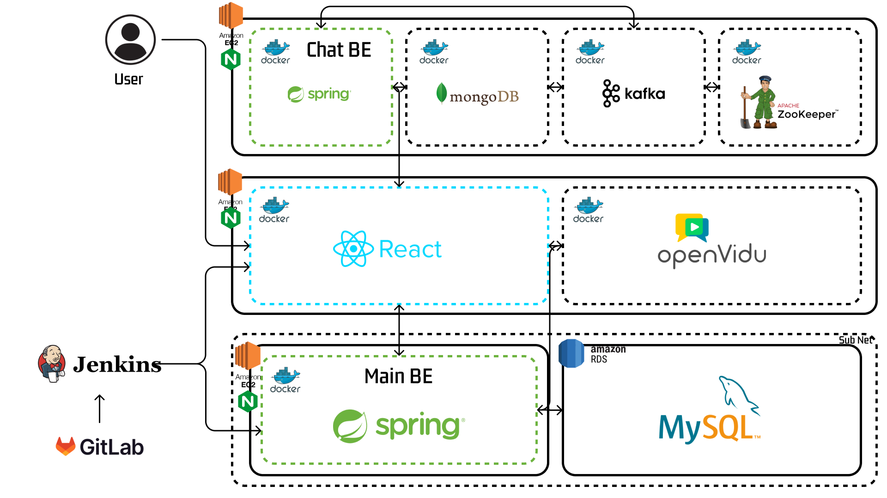
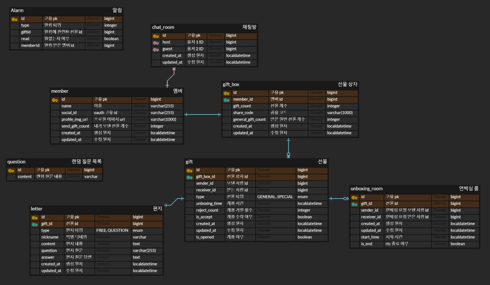

## 발렌타인데이를 특별하게, 익명 편지 서비스 🍫Chocoletter🍫

 
 

## 소개 🍫

초콜릿보다 달콤한 설렘을 전하세요! 🍫✉️   
Chocoletter와 함께 특별한 발렌타인데이를 만들어보세요.  
익명으로 전하는 진심 어린 마음이 서로를 궁금하게 만들고, 설레는 마음을 키워갑니다. 
매일매일 쌓이는 익명의 편지로 서로의 마음을 추측하며 설레다가, 발렌타인데이 당일에는 드디어 그 설렘의 주인공과 만날 수 있어요.  
영상통화나 채팅을 통해 서로의 마음을 확인하는 특별한 순간을 경험하세요.  
누군가에게 전하고 싶었던 마음, 이제 Chocoletter로 용기내어 시작해보세요.  당신의 특별한 발렌타인데이가 시작됩니다. ❤️
 

## 서비스 사용 예시

- 제작 후 gif 형식으로 들어갈 예정입니다.
 

## Tech Stack 🛠️

### FE

### BE
    

### Infra
   

### DB
 

### Co-Op

### WebRTC

 

## Architecture

 

## ERD

 

## Member 👨‍👩‍👧‍👦

|                                   Backend / 팀장                                    |                                  Backend / 백엔드 리드                                  |                                  Backend / Infra                                   |                           Frontend / 프론트엔드 리드                            |                                 Frontend / UIUX                                  |                                  Frontend / 디자인                                   |
| :-------------------------------------------------------------------------------: | :--------------------------------------------------------------------------------: | :--------------------------------------------------------------------------------: | :----------------------------------------------------------------------: | :------------------------------------------------------------------------------: | :-------------------------------------------------------------------------------: |
|  |  |  |  |  |  |
|                        [이준희](https://github.com/Jun2-Lee)                         |                                  [조예슬](yeseul106)                                  |                        [손훈서](https://github.com/Son-Hunseo)                        |                                   [김두철](https://github.com/Doocheol)                                    |                        [김한송](https://github.com/Lycirrus)                        |                        [송지수](https://github.com/sjisu7525)                        |
 

## 팀 문화 🌱

1. 단톡 알림 끄지 않기, 이모지 반응만 남기지 않기
2. 팀원이 의견을 내면 일단 긍정적으로 반응하기
3. 부끄러워하지 않고 물어보기
4. 코어타임 지키기 -> 작업 가능시간 공유!
1. Merge Request & Commit & Code 컨벤션 잘 지키기!
2. Daily Scrum 하기 (매일 시작과 종료 모두)
3. 데드라인을 구체적으로 정하기
4. 기술 팀 블로그 쓰기
5. 기획부터 개발까지 Step By Step
 

## 팀 그라운드 룰 🎯

1. Merge Request & Commit & Code 컨벤션 잘 지키기!
2. Daily Scrum 하기 (매일 시작과 종료 모두)
3. 데드라인을 구체적으로 정하기
4. 기술 팀 블로그 쓰기
5. 기획부터 개발까지 Step By Step
 

## Contact

 (예정)
