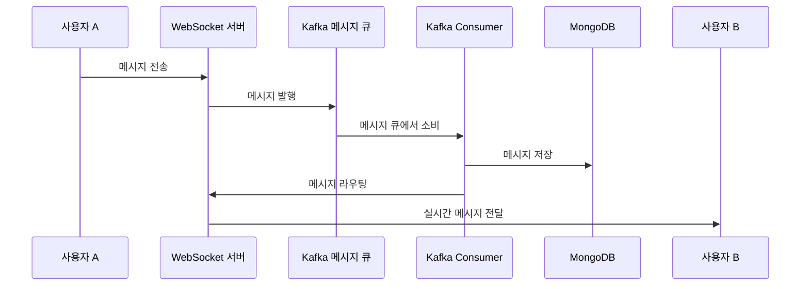

# TIL(Today I Learn) :fire:

### 2025.01.14

#### 한 일
- 역할 분담
- 릴리즈 날짜 정하기
- ERD 완성

#### 해야 할 일
- 웹소켓 로직 생각해보기
- 프로젝트 세팅하기

### 공부한 것

#### 웹 소켓 연결 과정(간단)

1. A 클라이언트가 서버로 자신의 정보를 보낸다
2. B 클라이언트도 서버로 자신의 정보를 보낸다
3. 둘 다 있을 때, A가 B로 연결 요청을 보낸다
    1. A → 서버로 offer (이 때, 타겟인 B의 아이디 필요)
    2. B → 서버로 answer (이 때, A의 아이디 필요)
    3. A → 서버로 ice-머시기 보냄
    4. B도 보냄
4. 연결 완료!

#### 실제 우리 로직에서는 어떻게 동작할까?

(가정) A와 B가 스페셜 초콜릿을 주고 받았다

 → A가 B에게 줌. 시간은 2시.

1. 1시 55분에 알림 전송(이 때, 별도의 회의실 등의 구축 불필요)
    a. A와 B에게 모두 전송
2. A가 먼저 들어온다고 가정 → session_list에 A의 세션 정보가 추가
    b. 이 때, B가 들어와있는지 체크(별도의 요청 필요)

3-1 . 안들어와있으면, 대기 → 상대방이 안들어와있다는 메시지를 내려줌

3-2. 들어와있으면(위의 체크 상황에서 들어와있다는 메시지를 내려줬으면)

4. 늦게 들어온 사람(A)이 들어와있던 사람에게 offer, B가 A에게 answer, 그 뒤에 ice ~보낸 뒤 연결


### 2025.01.15

#### 한 일
- 기획 고도화
- 어떻게 하면 우리 서비스를 더 들어오게 만들까..?

-> 기존의 힌트 방식 제거 후 미리 까보기 방식 채택

### 공부한 것
#### 채팅 시스템 설계

- 1:1 채팅만 지원 ⇒ 대신 양방향으로 매칭 되면 만들어주기
- 알림까지 하기에는 무리
    - 다른 방법 생각
- 그렇다면 그냥 실시간 채팅만이라도 가져가자
    - 웹소켓
- 데이터베이스 ⇒ NoSQL
    - **키/값 저장소는 수평적 규모 확장이 쉽다.**
    - **키/값 저장소는 데이터 접근 지연시간(latency)가 낮다.**
    - 관계형 데이터베이스는 롱 테일(long tail)에 해당하는 부분을 잘 처리하지 못하는 경향이 있다. 인덱스가 커지면 데이터에 대한 무작위적 접근(random access)를 처리하는 비용이 늘어난다. → 우리는 채팅 내용에서 언급을 찾거나, 특정 메세지를 검색하는 기능은 없기 때문에 이 점은 고려하지 않아도 됨
    - 페이스북 메신저는 HBase를 사용하고 디스코드는 카산드라 NoSQL을 사용하고 있다.
    - 해당 서비스들은 60억건의 채팅 <-> 우리 서비스는 그렇게까지 많지 않을 것 같은데 RDB로도 되지 않을까..?
    - 고민해봐야 함
- 채팅 서버 / API 서버 따로 두기
- 메세지큐 → 카프카 예정


### 2025.01.16

#### 한 일
- Entity 작성
- 프로젝트 구조 설계 후 설정

#### 공부한 것
- openvidu를 사용할 예정인데, 5초 카운트와 연결시 1분 세팅은 어떻게 할까?
- openvidu api 문서를 보니, 우리 백엔드 서버로 hook을 날려 알려줄 수 있다.
- 이걸 활용하여 RTC 상대 검증과 방 입장을 해결할 수 있을 것 같다.

### 2025.01.17

#### 한 일
- 전체 선물 조회 api 완성
- 코딩 컨벤션 수정 & 확정정

### 2025.01.20

#### 한 일
- 도메인 수정
- 랜덤 질문 조회 api 작성
- 선물 리스트, 개별 선물 조회 api 작성

#### 공부한 것
- Validation 하는 법
    - Dto 수준에서 Validation
    - DB 제약조건으로 Validation 하는 것

- Random한 객체를 찾아올 때 DB or Server?

### 2025.01.21

#### 한 일
- api 마무리
- api 오류 수정

#### 공부한 것
**채팅 설계**
채팅 시스템을 단단하게 설계하려면 어떤 것을 고려해야 할까..?
---
**1차 설계안**

1. 채팅 서버를 따로 둘 것인가?
- 하나로 두는 경우
  - SPOF가 발생 가능.. => 다른 서비스까지 먹통이 되면 안될듯
  - 채팅 서버와 백엔드 서버를 분리시키자
- 그럼 몽고DB는 따로??
  - mongoDB를 도커로 띄우던, 로컬에 설치해서 띄우던 ec2 내에서 하는 동작은 ec2가 다운되면 별도의 백업 옵션을 키지 않는 이상 다 날아감
  - 근데 그렇다고 해서 처음부터 mongoDB 까지 따로 두는건 오벌 엔지니어링
  - 일단 같은 데에다 해보고 부하 테스트를 진행하기로

2. 채팅 데이터 관리
- key - value ⇒ No!
    - mongoDB에서는 어떤 식으로 관리를 해야 할까..
        - 근데 채팅은 보통 document db를 쓰려나 ?
    - 근데 해당 메세지 ID는 순서를 표현할 수 있어야 함
        - createdAt으로 판별하기에는 동시에 만들어질 수 있기 때문이다..!
<br>

**최종**
- 채팅방 리스트 조회, 새 채팅방 생성 → MySQL
- 채팅방 ID를 통해 채팅 메세지 내용 조회  → MongoDB

#### 1차 대충대충 설계안
- Spring 프로젝트를 하나 더 준비(채팅 서비스 용도로)
- 이 서비스에는 이제 단순하게 채팅 관련된 기능만 넣어놓으면 좋을 것 같음
- DB는 몽고DB로 “채팅 내용, 채널ID(RoomId), 보낸 사람. createdAt”의 정보를 저장
- 근데 이제 흠.. 나는 채팅방(세션)을 직접 메모리에서 관리를 해줬었는데, 메시지 브로커를 붙이면 어떻게 될 지는 잘 모르겠네요..


### 2025.01.22
#### 한 일
- 오픈 비두 서버 연결하기
- 오픈 비두 세팅, 테스트

#### 공부한 것
**MongoDB는 어떻게 쓰는 걸까..?**
#### NoSql

**장점**

- 데이터 간의 관계 X
- 단순 key-value 관계이기 때문에 Join 불가능
    - ⇒ 값을 찾을 때, key로 찾아야 함
- 대용량의 데이터 저장 가능
    - RDB와는 다르게 정형화 된 구조가 없기 때문에 확장에 용이
- 분산형 구조
    - 테이블이나 값 사이에 관계가 없어 여러 서버에 분산하기 좋다
    - 이미 구조가 분산형 구조로 설계되어있다ㅏ
- 유연한 스키마
    - 같은 컬렉션이더라도 각자 다른 이름과 데이터 타입을 가질 수 있다

**단점**

- 데이터 손실 가능성
- 일관성 보장 X
- 인덱스가 메모리에 저장되기 때문에 메모리 소모가 많음

#### 종류

- Key-Value
    - Redis, Oracle NoSQL DB
- Wide-Column
    - Hbase, Cassandra
- Document
    - MongoDB
- Graph
    - neo4j, Sones

⇒ 우리는 MongoDB를 채택! WHY? 이제 찾아야 함

도큐먼트가 값, 필드가 attribute, 컬렉션이 테이블 느낌쓰

#### 설치

```
brew tap mongodb/brew
brew install mongodb-community@6.0
// 설치 완료
brew services start mongodb/brew/mongodb-community@6.0
// 백그라운드에서 실행
brew install mongosh
// 터미널에서 보기 위한 shell 설치
mongosh
// 터미널에서 보기
```

#### 명령어

```
// Database 보기
show dbs
// 데이터 베이스 사용(자동 생성)
use {데이터베이스 이름}
// collection 보기
show collections
// 만들기(rdb의 테이블 느낌)
db.createCollection("{Collection 이름}")
// 값 넣기
db.chat.insertOne({ 키-밸류 페어들 })
```

넣어보니까 insertedId를 자동으로 생성해서 넣어주던데, 여기에 TimeStamp가 들어가 있어서 그 순서관리나 시간 관리가 자동으로 될 거 같긴 함..!!

물론 우리가 생성해서 `“_id” : 1` 이렇게 넣어줘도 되긴 함

### 여기부턴 Spring boot

JPA랑 비슷하게 MongoRepository라는게 있긴 함

```java
import org.springframework.data.mongodb.repository.MongoRepository;
import java.util.List;

public interface UserRepository extends MongoRepository<User, String> {
    // 메서드 이름 기반 쿼리
    List<User> findByName(String name); // name 필드로 검색
    List<User> findByAgeGreaterThan(int age); // 나이가 특정 값 이상인 유저 검색
    List<User> findByEmailContaining(String emailPart); // email에 특정 문자열이 포함된 유저 검색
}
```

이건 내가 하는 방법인 `@Query` ㅎㅎ

```java
import org.springframework.data.mongodb.repository.MongoRepository;
import org.springframework.data.mongodb.repository.Query;
import java.util.List;

public interface UserRepository extends MongoRepository<User, String> {
    // MongoDB 쿼리 직접 작성
    @Query("{ 'age': { $gte: ?0, $lte: ?1 } }") // 나이 범위 조건
    List<User> findByAgeBetween(int ageStart, int ageEnd);

    @Query("{ 'name': ?0, 'email': { $regex: ?1, $options: 'i' } }") // 이름과 이메일 패턴 검색
    List<User> findByNameAndEmailPattern(String name, String emailPattern);

    @Query(value = "{}", sort = "{ 'age': -1 }") // 나이를 기준으로 내림차순 정렬
    List<User> findAllAndSortByAgeDesc();
}
```

그리고 Redis 쓸 때 처럼 Template으로 쓰는 방법도 있음

```java
import org.springframework.data.mongodb.core.MongoTemplate;
import org.springframework.data.mongodb.core.query.Criteria;
import org.springframework.data.mongodb.core.query.Query;
import org.springframework.stereotype.Repository;
import java.util.List;

@Repository
public class UserCustomRepository {
    private final MongoTemplate mongoTemplate;

    public UserCustomRepository(MongoTemplate mongoTemplate) {
        this.mongoTemplate = mongoTemplate;
    }

    public List<User> findUsersByCustomCriteria(String name, int minAge, int maxAge) {
        Query query = new Query();
        query.addCriteria(Criteria.where("name").is(name)); // name 필터
        query.addCriteria(Criteria.where("age").gte(minAge).lte(maxAge)); // 나이 범위 필터

        return mongoTemplate.find(query, User.class); // User 엔티티에 매핑
    }

    public List<User> searchUsersWithRegex(String emailPattern) {
        Query query = new Query();
        query.addCriteria(Criteria.where("email").regex(emailPattern, "i")); // 대소문자 구분 없이 이메일 검색

        return mongoTemplate.find(query, User.class);
    }

    public long countUsersAboveAge(int age) {
        Query query = new Query();
        query.addCriteria(Criteria.where("age").gt(age)); // 나이가 특정 값 이상인 문서 개수 카운트

        return mongoTemplate.count(query, User.class);
    }
}

```

#### 매핑? 엔티티?라고 해야 되나

```java

@Document(collection = "chat") // MongoDB 컬렉션 지정
@NoArgsConstructor
public class Chat {

    @Id // MongoDB의 _id 필드와 매핑
    private String id;

		private Long roomId
    private Long senderId;
    private String content;
    // 아이디에 자동으로 들어간다는데, 굳이 필요할까 싶기도 함
    private String createdAt;

		@Builder
    public User(String name, String email) {
        this.name = name;
        this.email = email;
    }
}

@Document(collection = "chat") // MongoDB 컬렉션 지정
@NoArgsConstructor
public class ChatRoom {

    @Id // MongoDB의 _id 필드와 매핑
    private String id;

		private Long roomId
    private Long senderId;
    private String createdAt;

		@Builder
    public User(String name, String email) {
        this.name = name;
        this.email = email;
    }
}

```

이런식으로 설정하고 쓰면 될듯

### 2025.01.23
#### 한 일
- 채팅 설계,, 생각,,

#### 공부한 것
#### 웹소켓.. 뭘까..? 너란 녀석…

http 통신과는 다르게, 핸드쉐이크를 통해 연결을 하고 실시간으로 통신을 할 수 있게 해준다.

⇒ 첫 접속까지는 http통신을 하지만, 연결이 된 이후로는 프로토콜이 바뀐다!!

첫 연결 이후로는 ws://~로 엔드포인트가 정해진다.


**웹 소켓의 차이점**

- 이 웹소켓 프로토콜은 헤더가 굉장히 작아서 Overhead가 거의 없음
- 접속한 상태라면 클라이언트나 서버로부터 데이터 송신이 가능
- `ws://www.chocolate-letter.com/chatting` 이런식으로 url이 됨(도메인은 다르겠지만..

**고려해야 할 점**

- 갈래이 말래이에서는 없었지만, 만약 비정상 종료를 했을 때 → 연결을 끊어야 되는데, 이거 생각해봐야 함
- 동접자 관리,, 우리 프리티어라,, 사양이,,

#### 자 이제 실전,,

기억이 잘 안난다…

#### V1

단순하게 웹소켓만 뚫어서, **우리 웹소켓에 연결되어있는 모든 사용자**에게 보내기

⇒ 이게 이제 그냥 웹소켓만 쓰는 거..

#### V2

STOMP를 사용해서 메시지 브로커를 이용

⇒ 갈래이 말래이에서 사용한건데, STOMP 프로토콜을 사용해서 메시지 형식을 정의, 구독 or 접속 등의 행위를 지정해줘서 사용하기 편함…

- 여기까지만 해줘도 기본적으로 채팅 시스템을 만들 수는 있다..!!

→ 구독 발행 시스템으로 구현했었음..

- 예를 들어 “chatroom12”라는 채널이름을 만듬(갈래이 말래이에선 여행 계획을 처음 생성하는 시점, 우리 서비스에선 이제 둘 사이에 선물을 주고 받았을 때? 만들면 되지 않을까요)
    - 이 때, 갈래이 말래이에선 계획을 생성하는 사람은 채널을 만듬과 동시에 해당 채널을 구독하는 요청을 보냈었음
- 그 다음, 여행 계획 짜는 방에 초대를 하고, 들어올 때 해당 방의 채널을 구독
- 그리고 그 방에 들어오는 순간에 연결 요청을 보내고, 방에서 나갈 때 연결 해제 요청을 보냄
    - 우리도 이제 연결 해제 요청을 보내는 부분 로직을 좀 생각해봐야 할 것 같음…

#### V3

STOMP를 쓰면서 + 메시지 큐까지 붙이는 방법(우리가 채택할 방법)

⇒ STOMP는 기본적으로 스프링에서 제공해주는 메시지 브로커를 쓸 수도 있지만, 외부 메시지 브로커를 붙일 수도 있다..(RabbitMQ나 Kafka같은거..)


### 2025.01.24
#### 한 일
- 채팅 설계 마무리

#### 공부한 것
#### 채팅 시스템 2차 설계안




- 사용자 A가 WebSocket으로 메시지 전송
    - 채팅방에 입장 했을 때 웹소켓이 연결
    - 채팅방에서 나갈 떄 웹소켓 끊기
        - 비정상 종료라면 ?
            - 추후 논의 해서 잡기
- WebSocket 서버가 메시지를 Kafka에 발행
- Kafka Consumer가 메시지 소비
    - 해당 유저가 속해있는 채팅방을 이미 구독을 다 하고 잇는 상태에서
        - 구독을 그럼 어디서 ?
            - 우리 서비스 구조 상, 채팅방이 정해져있음
            - 애초에 다 구독을 하고 들어갈까 ?
                - → 14일 이후에 첫 로그인 하면 채팅룸 디비에서 쫙 가져와서
                - → 필드값 하나 추가 : 이 값이 false일 때만 컨슈머에서 구독 싹다 하기
            - 이런 방법이 아니라면 채팅방을 들어왔을 때 구독을 해야하는데
                - 문제 : 내가 채팅방에 들어가기 전에 온 메세지는 확인이 불가함
    - 큐에 쌓인 메세지를 가져오는거지 대신 커밋 이후로 가져오기
        - 이전에 읽었던 메세지 이후로
- MongoDB에 메시지 영구 저장
- WebSocket을 통해 사용자 B에게 실시간 메시지 전달

#### part1. 클라이언트 ↔ 웹소켓 서버

- 사용자가 채팅방에 입장하면 우리쪽에 웹소켓 연결 요청
- 유저 1이 연결을 하잖아. 근데 상대가 유저 2야.
- 유저 2는 접속을 안했어. → 메세지 쌓이기
- 유저 2도 접속을 했어. → 메세지들이 실시간 통신이 되는거 ?

controller 입장

- ws://~~~~~ 요청
    - 메세지 안에 보내는 사람, 받는 사람 등의 정보 꺼내서
- 카프카 프로듀서로 메세지 전송

#### part2. 웹소켓 ↔ 카프카

- 웹소켓에서 받은 메세지를 프로듀서가 받아서 토픽에 저장
- 해당 토픽을 구독하고 있는 컨슈머가 메세지 꺼내서 웹소켓으로 주기

- 웹소켓은 메세지 받아서 ? 어케 줌 ???????
- 웹소켓은 내려주는 포인트..? 어디로 내려줘요 ?
    - 아 오케이 그럼 그 채널을 구독한 사람한테 보내준다는거지 ?

#### part3. 몽고디비

#### 데이터 저장

- 카프카에서 데이터를 저장하겠지 ?

#### 데이터 조회

- 사용자가 채팅방에 입장햇을 때 → 해당 채팅룸에 대한 데이터를 뽑아서 뿌려줘야됨
- 채팅방 목록을 봣을 때 → 쌓인 메세지가 몇개인지, 가장 최근 메세지가 뭔지 알려줘야됨
    - 카프카에서 마지막을 본 메세지 오프셋을 커밋할 수는 있음
    - 디비에도 어디까지 봤는지를 알아야 할거 같음
    - 그래야 채팅방 목록에서 유저 1이랑 유저 2랑 다르게 가져옴. (안본 메세지 개수)
        - receiverIsView
        - 확장성을 생각하면 채팅방목록에서 몇개 안봤는지 카프카에서도 가능 / 읽음 표시 ?
            - 읽음 처리
            - ㅇㄴㄴ
            - ㄴㄴㄴ 1
            - ㄴㄴㄴ 1

#### 궁금증

- 카프카는 채팅방 별로 토픽을 만들어서 큐에 담에두고 빼오는데
    - ? 유저 1은 4번까지 유저 2는 2번까지 읽었으면 이 두개를 판별 가능 ?
    -> 이 부분을 그래서 따로 DB에 저장해서 읽었는지, 아닌지를 관리하기로!


### 2025.02.03
내 언박싱 일정을 조회하는 api를 작성할 때, 언박싱 일정 개수만큼 DB에 쿼리가 날아가는 문제점이 발견되었다.

이걸 어떻게 해결해야 할까?

- 언박싱을 진행하는 사람의 닉네임을 가져오기 위한 부분에서는, fetch join을 활용하여 추가 쿼리 발생을 줄여주었다
  - Gift와 Member를 한번에 조인해서 가져오면서, N+1 문제를 어느정도 해결하였다
-> 하지만, 상대방의 이름을 가져오는 곳에서 N+1이 또 발생하게 되었다

이건 어떻게 해결할까?

- Gift의 Id를 배열로 만들어, 데이터베이스에서 IN절로 한번에 가져오는 쿼리를 짰다.
  - 리턴을 Map으로 받아서, <Long, String>에 넣은 뒤, 사용할 때 꺼내쓰는 방식을 선택하였다

위의 과정을 거쳐서, 쿼리가 불필요하게 여러 번 날아가는 문제를 해결할 수 있었다!!

### 2025.02.05
서비스가 얼추 완성되었으니, 이제는 테스트를 진행할 수순이다.

테스트는 부하테스트와 성능테스트 두 가지를 진행하였다

부하테스트를 진행한 방식은 Jmeter를 사용하여 점점 부하를 늘리는 방식으로 진행하였다.

처음에는 TPS를 25정도로 놓고 진행하였을 때, 아무 이상 없이 정상적으로 동작하는 것을 확인하였고,
그 뒤 TPS를 2~4배까지 늘려가며 진행하였을 때, TPS가 1200쯤에 가까워질 때부터 타임아웃에 걸려 응답을 받지 못하는 경우가 늘어나기 시작했다.

하지만 서버가 꺼지거나 하는 문제점은 발생하지 않았고, TPS 1200은 서비스 중에 발생할 수 없는 양이라고 생각되어, 부하테스트를 이대로 종료하였다

### 2025.02.06
부하테스트 때는 단순하게 데이터가 얼마 들어있지 않은 상태에서 진행했기 때문에 응답의 속도 또한 빠를 수 있었다.

하지만, 실제 서비스에서 데이터가 많아지게 되면 응답 속도가 어디까지 나올 수 있을까?

때문에 50000개의 Gift, Letter를 데이터베이스에 넣은 뒤, 테스트를 진행하였다.

처음에 테스트에서는 그냥 풀 스캔 방식의 GET api 호출이었는데, 
초당 40 ~ 60개의 트랜잭션 처리를 하였고, 평균 응답시간 4.6초로 매우 좋지 않은 성능을 보여주었다.

때문에 성능 개선을 위해 Index를 거는 방법을 선택하였고, 초당 200개의 트랜잭션 처리를 하였고, 평균 응답시간 0.2초로 눈에 띌만한 성능 개선을 보여주었다.

우리의 서비스에서는 인덱싱을 직접 해주었는데, 외래키를 거는 등의 연관관계를 걸어놓으면, 인덱스가 자동으로 생성된다.
이 부분에 대해서는 Trade off를 잘 생각해보아야 할 것 같다.

### 2025.02.07
암호화

익명 편지 서비스에서 편지 내용의 암호화는 매우 중요한 부분이다.

그렇다면 어떻게 암호화를 진행할까?

1. 백엔드에서 암호화를 진행한다
2. 해시를 사용한다
3. 비대칭 키 암호화를 선택한다.

1번의 방법은, 백엔드에서 암호화와 복호화를 모두 할 수 있기 때문에 좋지 못한 암호화 기법이라고 생각되었다.

2번의 방법은, 누구도 복호화를 할 수 없게 해시를 사용해 암호화를 하는 것이다 -> 읽는 사람도 복호화가 되지 않기 때문에 기각

따라서 3번의 방법을 채택하게 되었다.

유저의 Id값으로 비밀키와 공개키를 만든 뒤, 공개키들은 서버에 저장하고 비밀키는 클라이언트에서 관리하게 하였다.

이후 편지를 보내고 싶은 사람은 상대의 공개키를 가져온 뒤, 해당 키로 암호화를 진행하여 서버로 메시지 전송 요청을 날린다

편지를 받은 사람은 본인의 비밀 키를 사용하여 복호화, 편지를 읽을 수 있게 된다!!


### 2025.02.10
서비스 중의 에러

서비스 도중, 여러 에러를 만났지만, 가장 큰 에러는 암호화 기법으로 인해 편지 전송이 되지 않는 문제였다.

편지를 보내지 않았지만, 이미 같은 상대에게 편지를 보냈다는 알림이 뜨며 편지가 전송되지 않았다.

해당 문제는 금방 해결할 수 있었다. 데이터베이스에는 varchar(255)로 선언이 되어있는데, 암호화를 진행하며 편지의 내용이 255자를 넘어가게 되는 것이 그 문제였다.

때문에 varchar를 text로 바꾸는 것으로 간단하게 해결되었지만, 에러 메시지 분기가 되어있지 않아 같은 상대에게 보냈다는 알림창밖에 뜨지 않은 것이 에러를 잡는 데 어려움을 겪게 하였다.

앞으로는 에러 메시지 분기를 철저하게 진행하여야겠다.....


